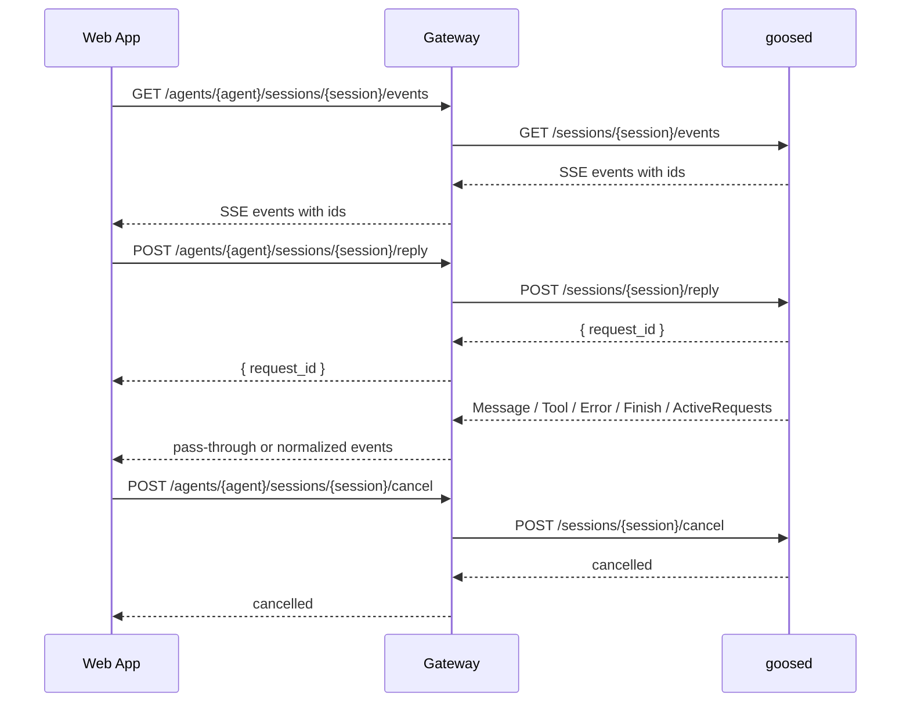

# AI Chat Session Refactor

## 目的

本文档定义 AI 对话从前端到 Gateway，再到 goosed 的端到端会话模型优化方案。目标不是修一个单点超时，而是把“用户提交请求”和“接收会话事件”解耦，让长任务、网络抖动、页面刷新、显式停止、后端错误都能被系统正确表达。

核心目标：

- 前端断开 SSE 或页面刷新不应默认取消 goosed 中仍在执行的任务。
- 用户显式停止时，才通过 Gateway 调用 goosed cancel/stop 能力。
- Gateway 不重复实现 goosed 已经具备的 event bus、active request、replay、agent cancellation 语义。
- 后端 LLM、工具、goosed、Gateway、前端各层错误都要如实呈现给前端，辅助客户决定重试、等待、停止、联系支持或调整输入。
- 保持前端只访问 Gateway，不直接访问 goosed。

## 背景

当前 `admin / qa-cli-agent / 20260423_2` 的中断链路显示，任务不是被 Gateway 的 first-byte、idle 或 max-duration timeout 触发，也不是 goosed 卡死。goosed 一直在产生工具调用和上下文处理事件。直接触发点是前端 `fetch` 的 180 秒 `AbortSignal.timeout`，前端断开 SSE 后 Gateway 认为客户端取消，随后调用 goosed stop，goosed 记录 `client hung up` 和 `Agent task cancelled`。

这说明当前设计把“浏览器当前这条 fetch 连接是否还活着”和“后端 agent 任务是否应该继续执行”绑定在了一起。这个绑定不适合 AI 长任务，因为模型、工具调用、上下文压缩、MCP 操作都可能超过普通 HTTP 请求的感知时长。

## 现状问题

### 传输和任务生命周期耦合

当前 `/reply` 是一次请求同时承担三件事：

1. 提交用户消息。
2. 承载 SSE 事件流。
3. 代表后端任务生命周期。

当浏览器超时、页面刷新、网络切换或组件卸载时，请求会被取消。Gateway 的 `SseRelayService` 在 `doOnCancel` 中会调用 goosed stop。最终用户看到的是任务中断，但系统很难区分“用户主动停止”和“客户端连接掉线”。

### timeout 语义混杂

当前链路里至少存在几类 timeout：

- 前端 fetch timeout：保护浏览器请求，但现在会间接取消 agent 任务。
- Gateway first-byte timeout：goosed 没有任何响应时的上游健康保护。
- Gateway idle timeout：goosed 长时间没有实际内容时的传输保护。
- Gateway max-duration：单次流式回复的硬上限。
- goosed 内部模型、工具、MCP、上下文处理 timeout。

这些 timeout 的目的不同，但当前缺少清晰的 owner 和错误表达。前端 180 秒 timeout 反而成为整条链路最短且最先触发的硬取消。

### 错误呈现过于模糊

前端现在能拿到 stream error，但 UI 主要显示“回答可能未完成，可以继续”等模糊提示。它没有稳定区分：

- 用户主动取消。
- 前端本地超时。
- 浏览器网络断开。
- Gateway 到 goosed 连接失败。
- goosed agent 任务取消。
- LLM provider 超时或报错。
- 工具/MCP 调用失败。
- 上下文超限或压缩失败。

结果是用户只能盲目继续或重试，无法判断是否应该等待、重试、缩小问题、切换模型、联系支持，还是检查外部系统。

## Goose Desktop 参考

本设计以 Goose Desktop 访问 goosed 的模式为主要参考，而不是在 Gateway 里重新造一套会话执行系统。

Goose Desktop 的关键做法：

- `POST /sessions/{session_id}/reply` 只负责提交请求，并返回 `request_id`。
- `GET /sessions/{session_id}/events` 是独立 SSE 事件通道，支持 `Last-Event-ID` 重连。
- `POST /sessions/{session_id}/cancel` 用于显式取消指定 request。
- goosed 内部维护 active requests，前端可以重连后恢复正在运行的请求。
- 页面刷新或 SSE 重连不是取消语义。

ops-factory 应采用同类模型，但必须通过 Gateway 代理和增强：

- 认证、用户隔离、agent 路由仍由 Gateway 负责。
- 前端仍只访问 Gateway。
- Gateway 只做协议桥接、观测、错误归一化和兼容迁移，不复制 goosed 的 event bus 和 agent 状态机。

## 目标架构



核心变化：

- 提交消息是短 HTTP 请求。
- 接收事件是独立、可重连的 SSE。
- 取消是显式 API。
- Gateway 不再把前端 SSE disconnect 自动解释为 agent stop。
- 前端通过 `request_id` 关联一次回复，通过 SSE event id 支持断线恢复。

## API 设计

### 提交消息

```http
POST /api/agents/{agentId}/sessions/{sessionId}/reply
```

请求体示例：

```json
{
    "messages": [
        {
            "role": "user",
            "created": 1776928807000,
            "content": [
                {
                    "type": "text",
                    "text": "ALM-267100314 怎么处理"
                }
            ]
        }
    ],
    "request_id": "optional-client-generated-id"
}
```

响应示例：

```json
{
    "session_id": "20260423_2",
    "request_id": "018f6f2a-...",
    "status": "accepted"
}
```

要求：

- 前端应在提交前先建立或恢复 session events 订阅。
- Gateway 将请求路由到对应用户、agent 和 goosed 实例。
- Gateway 可以接受前端生成的 `request_id`，也可以使用 goosed 返回的 `request_id`，但对前端必须稳定返回。
- 该请求使用短 timeout，例如 10-30 秒。提交失败只表示“任务没有被确认接受”，不等于 agent 执行失败。

### 订阅会话事件

```http
GET /api/agents/{agentId}/sessions/{sessionId}/events
Last-Event-ID: <last-event-id>
```

要求：

- Gateway 透传或映射 goosed SSE event id，不能丢失顺序和重连能力。
- 前端断线后使用 `Last-Event-ID` 重连。
- Gateway 可以发送 transport-level heartbeat，但不应把 heartbeat 当成 agent 内容。
- Gateway 不应因为前端连接关闭就取消 goosed active request。

### 取消请求

```http
POST /api/agents/{agentId}/sessions/{sessionId}/cancel
```

请求体示例：

```json
{
    "request_id": "018f6f2a-...",
    "reason": "user_cancelled"
}
```

要求：

- 只有用户显式点击停止、关闭任务，或产品定义的硬上限触发时才调用。
- Gateway 将 cancel 转发给 goosed。
- 前端应把取消状态与网络断开、超时失败区分展示。

### Legacy API 下线

Gateway 不再保留旧 `/reply` 流式接口作为运行时兼容路径。所有前端、SDK、渠道桥接和测试调用方统一迁移到 session API：

- 提交：`POST /sessions/{session_id}/reply`
- 订阅：`GET /sessions/{session_id}/events`
- 取消：`POST /sessions/{session_id}/cancel`

旧接口的客户端断开即 stop 语义是本次事故根源之一，不能继续作为回滚路径。

## 事件契约

Gateway 默认应尽量透传 goosed 原生事件，包括但不限于：

- `Message`
- `Error`
- `Finish`
- `Notification`
- `UpdateConversation`
- `ActiveRequests`
- `Ping`

Gateway 只在以下场景补充或归一化错误事件：

- Gateway 自己无法连接 goosed。
- Gateway 鉴权、用户、agent、session 路由失败。
- Gateway 到 goosed 的代理连接被基础设施中断。
- Gateway 强制执行平台级策略，例如硬超时或限流。

Gateway 生成的错误事件建议使用稳定 envelope：

```json
{
    "type": "Error",
    "layer": "gateway",
    "code": "gateway_goosed_unavailable",
    "message": "Agent service is unavailable.",
    "detail": "Unable to connect to goosed instance for agent qa-cli-agent.",
    "retryable": true,
    "suggested_actions": ["retry"],
    "session_id": "20260423_2",
    "request_id": "018f6f2a-...",
    "agent_id": "qa-cli-agent",
    "elapsed_ms": 12034,
    "trace_id": "..."
}
```

字段约定：

- `layer`: `frontend`、`gateway`、`goosed`、`provider`、`tool`、`mcp`。
- `code`: 稳定机器码，前端根据它做展示和动作建议。
- `message`: 给用户看的简短说明，需要走 i18n。
- `detail`: 给排障看的上下文，可在详情面板或日志里展示。
- `retryable`: 表示直接重试是否有意义。
- `suggested_actions`: 例如 `retry`、`continue`、`cancel`、`wait`、`contact_support`、`check_tool`、`reduce_context`。

如果 goosed 已经提供结构化错误，Gateway 不应覆盖语义，只补充 Gateway 可观测字段，例如 `agent_id`、`trace_id`、Gateway request id。

### 事件 envelope

Gateway 对外发送给 Web App 的 session event 必须满足以下稳定外壳。goosed 原始字段可以保留在 `payload` 或原事件对象中，但用于前端状态机的字段应稳定。

```json
{
    "event_id": "42",
    "type": "Message",
    "session_id": "20260423_2",
    "request_id": "018f6f2a-...",
    "chat_request_id": "018f6f2a-...",
    "agent_id": "qa-cli-agent",
    "payload": {},
    "trace_id": "..."
}
```

约定：

- `event_id`: 来自 SSE `id:`，只在 goosed 发送真实事件时推进。heartbeat/comment 不生成 `event_id`。
- `request_id`: Gateway/API 层使用的 request id。对于 goosed 已经命名为 `chat_request_id` 的事件，Gateway 可以补齐同值 `request_id`，但不能改写 goosed 原字段。
- `chat_request_id`: goosed session event 原生关联字段，前端优先用它匹配当前回复。
- `payload`: 承载 goosed 原始事件内容。第一阶段可以继续透传原事件，不强制包一层；但 SDK 和前端内部类型应按这个 envelope 建模，便于后续兼容。
- `trace_id`: Gateway 生成或透传的链路追踪 id，用于用户报错和日志定位。

### Error event envelope

所有需要展示给用户或辅助用户决策的错误，最终都应映射到以下错误 envelope。该 envelope 可以来自 goosed，也可以由 Gateway 或前端本地生成，但 `layer`、`code`、`retryable`、`suggested_actions` 必须稳定。

```json
{
    "type": "Error",
    "layer": "provider",
    "code": "provider_timeout",
    "severity": "error",
    "message_key": "chat.error.providerTimeout",
    "message": "The model provider timed out.",
    "detail": "OpenAI request exceeded provider timeout after 120000ms.",
    "retryable": true,
    "suggested_actions": ["retry", "reduce_context"],
    "session_id": "20260423_2",
    "request_id": "018f6f2a-...",
    "agent_id": "qa-cli-agent",
    "elapsed_ms": 120034,
    "http_status": 504,
    "upstream_status": 504,
    "trace_id": "..."
}
```

字段要求：

- `layer`: 错误归属层。允许值：`frontend`、`gateway`、`goosed`、`provider`、`tool`、`mcp`、`policy`。
- `code`: 稳定机器码，不能直接使用临时异常类名或英文句子。
- `severity`: `info`、`warning`、`error`、`fatal`。前端只用它决定视觉强度，不用它推断动作。
- `message_key`: 前端 i18n key。Gateway/goosed 可以先返回 `message`，但 Web App 最终用户可见文案必须走 i18n 映射。
- `message`: 后端兜底短文本，主要用于日志或暂未覆盖的 i18n key。
- `detail`: 排障详情，可以展示在详情面板或复制给支持人员，不应替代用户主提示。
- `retryable`: 表示直接重试同一输入是否通常有意义。
- `suggested_actions`: 前端动作建议。允许值见“前端动作契约”。
- `http_status`: Gateway 返回给前端的 HTTP 状态，或事件代理失败时的等效状态。
- `upstream_status`: Gateway 到 goosed、goosed 到 provider/tool/MCP 的上游状态。

第一阶段兼容要求：

- 如果 goosed 只返回 `Error { error: string }`，Gateway 不猜测 provider/tool 细节，只映射为 `layer=goosed`、`code=goosed_error`，并保留原始 `detail`。
- 如果 Gateway 自己知道错误来源，例如连接 goosed 失败、鉴权失败、session 不存在、平台 max duration，Gateway 必须生成明确 `layer/code`。
- 如果前端本地网络断开或页面刷新，前端本地生成 `layer=frontend` 的状态，但不能把它发送为后端失败，也不能触发 cancel。

### 错误分类矩阵

| 场景 | Owner | layer | code | retryable | suggested_actions | 前端默认呈现 |
| --- | --- | --- | --- | --- | --- | --- |
| 浏览器网络断开、页面刷新、SSE 本地 abort | Web App | `frontend` | `frontend_events_disconnected` | true | `reconnect`, `wait` | 显示正在重连，不提示任务失败 |
| 用户点击停止 | Web App + goosed | `frontend` 或 `goosed` | `user_cancelled` | false | `new_request` | 显示已停止，不提示系统异常 |
| submit 请求超时但未确认 accepted | Web App/Gateway | `gateway` | `gateway_submit_timeout` | true | `retry` | 告知提交未确认，可重试 |
| Gateway 鉴权失败 | Gateway | `gateway` | `gateway_unauthorized` | false | `login`, `contact_support` | 提示登录或权限问题 |
| agent 不存在或用户无权访问 | Gateway | `gateway` | `gateway_agent_not_found` | false | `contact_support` | 提示 agent 不可用 |
| Gateway 无法启动或恢复 goosed | Gateway | `gateway` | `gateway_agent_unavailable` | true | `retry`, `contact_support` | 提示服务暂不可用 |
| Gateway 无法连接 goosed events | Gateway | `gateway` | `gateway_goosed_unavailable` | true | `retry`, `contact_support` | 提示连接 agent 服务失败 |
| Gateway 平台硬上限触发 | Gateway policy | `policy` | `gateway_max_duration_reached` | false | `reduce_context`, `new_request` | 说明已达到平台时长上限 |
| goosed active request 冲突 | goosed | `goosed` | `goosed_active_request_conflict` | true | `wait`, `cancel`, `retry` | 提示已有任务运行 |
| goosed agent 执行取消 | goosed | `goosed` | `goosed_request_cancelled` | false | `new_request` | 区分用户取消或策略取消 |
| LLM provider 超时 | goosed/provider | `provider` | `provider_timeout` | true | `retry`, `reduce_context` | 提示模型服务超时 |
| LLM provider 限流 | goosed/provider | `provider` | `provider_rate_limited` | true | `wait`, `retry` | 提示稍后重试 |
| LLM provider 鉴权或配额失败 | goosed/provider | `provider` | `provider_auth_or_quota_failed` | false | `contact_support` | 提示模型配置或额度问题 |
| 工具调用失败 | goosed/tool | `tool` | `tool_execution_failed` | depends | `retry`, `check_tool` | 展示工具名和失败详情 |
| MCP 服务不可达 | goosed/mcp | `mcp` | `mcp_unavailable` | true | `retry`, `check_tool`, `contact_support` | 提示外部工具服务不可达 |
| 上下文过大或压缩失败 | goosed/provider | `provider` 或 `goosed` | `context_too_large` | true | `reduce_context`, `new_request` | 建议缩小问题或新开会话 |

矩阵中的 provider/tool/MCP 细分应优先由 goosed 产出。Gateway 只在 goosed 没有结构化错误时做最小兼容映射，避免把业务语义长期重复在 Gateway。

### 前端动作契约

`suggested_actions` 只表达后端建议，前端仍可根据当前状态决定实际按钮。允许值：

| action | 含义 | 适用状态 |
| --- | --- | --- |
| `reconnect` | 重新建立 events SSE，并带上 `Last-Event-ID` | events 断开、网络恢复 |
| `wait` | 继续等待当前 request，不重新提交 | 长时间无可见进展、限流等待 |
| `retry` | 重新提交同一用户输入，生成新的 request id | submit 未确认、临时 provider/gateway 错误 |
| `cancel` | 显式调用 session cancel | active request 冲突、用户想停止 |
| `continue` | 继续当前会话的新一轮输入 | 非致命中断或部分结果可继续 |
| `new_request` | 开启新的请求或新会话 | 已取消、上下文异常、硬上限 |
| `reduce_context` | 缩短输入、减少附件或新建会话 | 上下文过大、provider timeout |
| `check_tool` | 检查工具/MCP 配置或外部系统 | tool/MCP 失败 |
| `login` | 重新登录或刷新凭证 | 鉴权失败 |
| `contact_support` | 联系管理员并附带 trace/session/request id | 配置、权限、系统性错误 |

前端展示规则：

- 只把 `retry` 显示为“重试”按钮；没有 `retryable=true` 时不默认鼓励重试。
- `reconnect` 是连接恢复动作，不是重新提交用户消息。
- `wait` 和 `cancel` 可以并存，表示任务仍可能完成。
- `contact_support` 必须展示或复制 `trace_id`、`agent_id`、`session_id`、`request_id`。
- `detail` 默认折叠，避免用排障文本替代用户决策提示。

## API 错误响应契约

session API 分为短请求和长连接，两类错误表达不同。

### `POST /sessions/{id}/reply`

submit 是短请求。它只回答“请求是否被接受”，不代表 agent 最终成功。

| HTTP 状态 | 含义 | body |
| --- | --- | --- |
| 200/202 | goosed 已接受 request | `{ "session_id": "...", "request_id": "...", "status": "accepted" }` |
| 400 | 请求体非法、active request 冲突或 goosed 拒绝 | Error envelope |
| 401/403 | Gateway 鉴权或权限失败 | Error envelope |
| 404 | agent/session 不存在或不可访问 | Error envelope |
| 409 | request id 冲突或状态冲突 | Error envelope |
| 424 | Gateway 无法启动/恢复 agent，或依赖服务失败 | Error envelope |
| 429 | 平台限流 | Error envelope |
| 500 | Gateway 未预期错误 | Error envelope |
| 502/503/504 | goosed 不可达、上游异常或超时 | Error envelope |

要求：

- submit 超时或失败时，前端不能假设 goosed 没有收到请求；如果已有 events 连接，应通过 `ActiveRequests` 或后续事件确认。
- 如果 submit 返回 accepted，但 events 后续失败，前端按 events 错误处理，不回滚 accepted。
- request id 必须在错误 body 中返回，至少返回前端传入的 id，便于排障。

### `GET /sessions/{id}/events`

events 是 SSE 长连接。连接建立前的错误使用 HTTP 状态和 Error envelope；连接建立后的错误使用 SSE `Error` event。

连接建立前：

| HTTP 状态 | 含义 |
| --- | --- |
| 200 | SSE 建立成功 |
| 401/403 | Gateway 鉴权或权限失败 |
| 404 | agent/session 不存在或不可访问 |
| 424 | Gateway 无法启动/恢复 agent |
| 502/503/504 | Gateway 无法连接 goosed events |

连接建立后：

- Gateway 到前端写入失败：只记录日志，前端本地进入 reconnecting；Gateway 不发送 cancel。
- Gateway 到 goosed 读取失败：如果还能写给前端，发送 `layer=gateway` 的 `Error` event，然后关闭 SSE；如果不能写，只记录日志。
- goosed 发送 Error：Gateway 原样透传，并补充可观测字段。
- heartbeat/comment：前端只用于连接健康，不推进 request 状态。

### `POST /sessions/{id}/cancel`

cancel 是显式动作，不应用来表达本地断线。

| HTTP 状态 | 含义 | 前端处理 |
| --- | --- | --- |
| 200/202 | cancel 已提交或 goosed 认为幂等成功 | 默认采用乐观本地取消：立即结束本地 loading/streaming，显示已停止，并忽略该 `request_id` 的滞后 `ActiveRequests`；强一致模式可以进入 `cancelling` 并等待 events 确认 |
| 400 | request id 非法或不可取消 | 展示明确错误 |
| 401/403 | 鉴权失败 | 提示登录/权限 |
| 404 | session/request 不存在 | 如果本地已无 active request，可视为已结束；否则展示错误或重新同步 active request |
| 502/503/504 | cancel 无法送达 goosed | 记录日志；如果 UI 已乐观结束，后续由 `ActiveRequests`、submit active request conflict 或页面重载恢复真相 |

cancel 要求：

- 用户点击停止时必须携带当前 `request_id`。
- Web App 默认对用户点击停止采用乐观取消：本地立即清理 active request、恢复输入框，并展示“已停止”。这是交互层权衡，不代表 Gateway 或 goosed 已经产出 terminal/cancelled event。
- 乐观取消后，前端必须记住本地已取消的 `request_id`，避免下一批滞后的 `ActiveRequests` 把同一个请求重新恢复成 streaming/reconnecting。
- 如果后续 `ActiveRequests` 不再包含该 `request_id`，可以清理本地 cancelled 标记。
- 如果 cancel 请求失败，前端至少记录日志。产品若选择强一致模式，可以保留 `cancelling` 状态并把失败展示为 `gateway_cancel_failed`；若选择 Goose Desktop 风格的乐观模式，则把失败视为后台同步问题，由下一次 active request snapshot、submit conflict 或页面重载纠正。
- 取消确认来源仍然可以是 goosed/Gateway 的 terminal 或 cancelled 事件，也可以是 events 重连后 `ActiveRequests` 已不再包含该 `request_id`。区别在于乐观 UI 不阻塞用户等待这个确认。

#### Goose Desktop 对照

Goose Desktop 的 `useChatStream.stopStreaming` 采用乐观取消：先 abort in-flight reply POST，再调用 `sessionCancel({ request_id })`，随后立即取消本地 listener、清空 active request refs，并把 chat state 置回 `Idle`。`sessionCancel` 失败只写 `console.warn`，不会把 UI 留在 cancelling。对应服务端 `/sessions/{id}/cancel` 返回的是 "Cancellation accepted"，内部通过 `SessionEventBus.cancel_request(request_id)` 触发 cancellation token；active request 列表会在下一次注册/清理时剔除已 cancelled token。

ops-factory 的 Web App 可以沿用这个权衡，原因是“停止”在用户感知上更接近本地中断命令：用户需要立即恢复输入和控制权，而不是被一个可能不会产生独立 cancelled event 的后台确认流程卡住。代价是短时间内 UI 真相可能领先于服务端真相，因此实现必须保留本地已取消 request id 的过滤，并依赖后续 `ActiveRequests`、submit conflict 或页面重载做最终同步。

## 职责边界

### Frontend

Frontend 负责用户交互和本地连接状态：

- 提交前建立或恢复 session events 监听。
- 保存 `session_id`、`request_id`、last event id。
- 页面刷新、组件重挂载、网络恢复后重新订阅 events。
- 用户点击停止时调用 cancel。
- 根据错误 envelope 展示明确状态和下一步动作。
- 区分本地连接问题和后端任务失败。

Frontend 不负责：

- 直接访问 goosed。
- 根据 SSE disconnect 推断后端任务应该停止。
- 隐藏后端错误并统一提示“继续”。

### Gateway

Gateway 负责平台边界和协议桥接：

- 认证、用户身份、agent 路由和 goosed 实例发现。
- 必要时启动或恢复 agent 进程。
- 代理 session reply、events、cancel。
- 保持 goosed event id、request id、session id 的可追踪性。
- 对 Gateway 自身错误生成结构化错误事件。
- 记录关键观测日志和指标。

Gateway 不负责：

- 重新实现 goosed event bus。
- 自己维护 active request 真相。
- 在新 session events 模式下，因为前端 SSE disconnect 自动 stop agent。
- 解释 LLM provider、工具、MCP 的业务级失败，除非 goosed 没有结构化表达，需要做兼容映射。

### goosed

goosed 负责 agent 执行语义：

- 接收 reply 并创建 request。
- 维护 active requests。
- 发送 session events。
- 支持 `Last-Event-ID` replay。
- 执行 cancel token。
- 处理模型、工具、MCP、上下文压缩、max turns 等内部逻辑。

ops-factory 不应在 Gateway 复制这些能力，只通过 Gateway 暴露给前端。

## Timeout 策略

### 前端

- `reply submit timeout`: 10-30 秒，只保护“提交是否成功被接受”。
- `events stream`: 不设置 180 秒总超时。连接断开时进入 reconnecting，不自动取消后端任务。
- `no visible progress warning`: 例如 30-60 秒没有非 ping 事件时，提示“仍在运行，可等待或停止”，但不取消。
- `user cancel`: 立即调用 cancel API。

### Gateway

- `goosed connect timeout`: 短 timeout，用于连接失败快速返回。
- `events first-byte timeout`: 只用于判断 goosed events endpoint 是否不可用。
- `events idle timeout`: 应只作为传输健康保护，且需兼容 goosed heartbeat。
- `platform max duration`: 如果产品需要硬上限，必须通过 cancel API 显式取消，并向前端发送 `gateway_max_duration_reached`，而不是表现成普通断流。

### goosed

goosed 内部已有模型、工具、MCP、上下文和 agent loop 相关控制。Gateway 不重复配置这些策略，只呈现 goosed 返回的结构化错误或状态。

### 建议默认值

| 层级 | 配置 | 建议 | 语义 |
| --- | --- | --- | --- |
| Frontend | submit timeout | 10-30s | 只保护提交请求 |
| Frontend | event stream total timeout | none | 不以连接时长取消任务 |
| Frontend | progress warning | 30-60s | 只提示用户 |
| Gateway | goosed connect timeout | 5-10s | goosed 不可达 |
| Gateway | first byte timeout | 30-120s | events endpoint 无响应 |
| Gateway | idle timeout | 大于 goosed heartbeat 间隔 | 传输异常 |
| Gateway | platform max duration | 产品策略决定 | 必须显式 cancel 并结构化告知 |

## 前端状态机

建议前端对单次 request 使用显式状态机：

- `idle`: 没有进行中的请求。
- `submitting`: 已发起 submit，等待 accepted。
- `accepted`: Gateway/goosed 已确认 request。
- `streaming`: 正在接收消息、工具、通知或错误事件。
- `thinking`: 后端有活动事件但没有最终文本。
- `reconnecting`: events 连接断开，正在用 `Last-Event-ID` 恢复。
- `waiting`: 长时间没有可见进展，但任务未失败。
- `cancelling`: 用户已请求取消。
- `cancelled`: 用户请求停止后，Web App 已按乐观取消策略结束本地请求；在强一致模式下，也可以仅在 goosed/Gateway terminal/cancelled event 或 `ActiveRequests` 不再包含该 `request_id` 后进入该状态。
- `failed`: 收到不可恢复错误。
- `completed`: 收到 finish。

UI 展示原则：

- `reconnecting` 不显示为任务失败。
- `waiting` 提供“继续等待”和“停止”，不默认建议重试。
- `provider` 或 `tool` 层错误展示可重试性和具体动作。
- `gateway` 连接错误可以建议重试或联系支持。
- `cancelled` 说明是用户或策略取消，不当作系统失败；乐观取消下它优先表达“用户已恢复控制权”，不承诺服务端已经完全清理。

## 可观测性

每个 request 至少需要贯穿以下字段：

- `user_id`
- `agent_id`
- `session_id`
- `request_id`
- `gateway_request_id`
- `goosed_process_id` 或实例标识
- `trace_id`

关键日志点：

- Gateway 接收 submit。
- Gateway 转发 submit 到 goosed。
- goosed 返回 accepted/request id。
- Gateway 建立 events 代理。
- Gateway events disconnect/reconnect，区分 client disconnect 和 upstream disconnect。
- Gateway 转发 cancel。
- goosed 返回 finish/error/cancelled。

关键指标：

- submit accepted latency。
- events reconnect count。
- active request duration。
- user cancel count。
- gateway-originated error count。
- goosed/provider/tool/mcp error count。
- request completed/cancelled/failed ratio。

## 迁移计划

### Phase 1: Gateway 切换到 session API 代理

- 新增 Gateway 到 goosed 的 `/sessions/{session_id}/reply`、`/events`、`/cancel` 代理。
- 移除 Gateway 旧 `/reply` 和 `/agent/stop` 入口。
- Gateway 在新 events 模式下不因 client disconnect 自动 stop。
- 补齐 Gateway-originated structured error。

### Phase 2: SDK 新增解耦接口

- `submitSessionReply(...)`: 短请求，返回 `request_id`。
- `subscribeSessionEvents(...)`: 独立 SSE，支持 `Last-Event-ID`。
- `cancelSessionReply(...)`: 显式取消。
- 移除旧 `sendMessage(...)`、`chat(...)`、`stopSession(...)`。

### Phase 3: Web App 默认接入

- 新增 chat hook 或重构现有 hook，采用 submit + events + cancel。
- 加入 active request 恢复逻辑。
- 替换模糊中断提示为结构化错误卡片。
- 所有可见文案走 `en.json` 和 `zh.json`。

### Phase 4: 验证

- 验证新链路的成功率、取消率、重连次数、耗时和错误分布。
- 出问题时通过结构化错误呈现给用户，而不是回退旧 `/reply`。
- Gateway 日志以 `request_id`、`session_id`、`agent_id`、`user_id` 串联排查。

### Phase 5: 清理旧路径

- 删除旧 `SseRelayService` 代码和测试。
- 删除前端旧模糊“继续”错误补救分支。
- 删除或迁移依赖旧 `/reply`、`/agent/stop` 的脚本和测试。

## 实施计划

### Step 0: 固化 goosed contract

先按当前 goosed 实现固化 Gateway 适配契约：

- `POST /sessions/{id}/reply`
  - request body: `{ "request_id": string, "user_message": Message, "override_conversation"?: Message[] }`
  - `request_id` 必须是合法 UUID。
  - response body: `{ "request_id": string }`
  - session 有 active request 时返回 400。
- `GET /sessions/{id}/events`
  - 支持请求头 `Last-Event-ID`。
  - SSE frame 使用 `id: <seq>` 和 `data: <json>`。
  - stream 初始阶段可能发送无 `id:` 的 `ActiveRequests`。
  - heartbeat 是 comment frame，例如 `: ping 0`，不应推进 last event id。
  - goosed 会在事件 JSON 中补 `chat_request_id`，并在不冲突时补 `request_id`。
- `POST /sessions/{id}/cancel`
  - request body: `{ "request_id": string }`
  - cancel 不存在的 request 当前仍可能返回 200；Gateway 不应把它误判为系统失败。

这一步不改代码，只把 Gateway、SDK、Web App 的实现都约束到同一个真实 contract。

### Step 1: Gateway 增加 session proxy 基础能力

目标：打通新 API，并下线旧 `/reply`。

预计修改：

- `gateway/gateway-service/src/main/java/com/huawei/opsfactory/gateway/controller/ReplyController.java`
  - 新增：
    - `POST /gateway/agents/{agentId}/sessions/{sessionId}/reply`
    - `GET /gateway/agents/{agentId}/sessions/{sessionId}/events`
    - `POST /gateway/agents/{agentId}/sessions/{sessionId}/cancel`
  - 复用现有 `getOrSpawn`、`ensureSessionResumed`、`resumeSession`。
  - 新 `events` 路径不调用 `SseRelayService.relay`，避免继承 `doOnCancel -> /agent/stop` 语义。
- `gateway/gateway-service/src/main/java/com/huawei/opsfactory/gateway/proxy/GoosedProxy.java`
  - 增加用于 raw SSE GET proxy 的方法，要求：
    - 透传 `Last-Event-ID`。
    - 透传 goosed 的 SSE `id:` 和 `data:`。
    - client disconnect 只取消 Gateway 到前端的响应写入，不调用 goosed cancel/stop。
  - 增加短请求 JSON post helper 或复用现有 `fetchJson(...)`。
- 新增 Gateway structured error helper。
  - Gateway 自身错误输出稳定 JSON，不覆盖 goosed 原生事件语义。

Gateway 不做：

- 不在 Gateway 维护 active request 状态。
- 不把 goosed 的 `Error { error: string }` 强行改成复杂业务错误。
- 不再保留旧 `/reply` 或 `SseRelayService` 兼容路径。

### Step 2: Gateway 测试

目标：证明新路径不会重复旧问题。

预计新增或扩展：

- `gateway/gateway-service/src/test/java/com/huawei/opsfactory/gateway/e2e/ReplyEndpointE2ETest.java`
  - 新 session reply 会转发到 `/sessions/{id}/reply`。
  - session events 会转发到 `/sessions/{id}/events`。
  - `Last-Event-ID` 会透传。
  - session cancel 会转发到 `/sessions/{id}/cancel`。
- `gateway/gateway-service/src/test/java/com/huawei/opsfactory/gateway/proxy/*`
  - SSE client cancel 不触发 `/agent/stop`。
  - upstream 连接错误能生成 Gateway structured error。
  - goosed 404/400/424 能按 HTTP 或结构化错误返回，不被吞成通用 500。

验收点：

- Gateway 不再暴露旧 `/gateway/agents/{agentId}/reply`。
- events proxy 的 disconnect 不触发 `/agent/stop` 或 `/sessions/{id}/cancel`。

### Step 3: TypeScript SDK 增加 session transport

目标：提供新接口，并移除旧 `sendMessage(...)`。

预计修改：

- `typescript-sdk/src/types.ts`
  - 增加：
    - `SessionReplyRequest`
    - `SessionReplyResponse`
    - `SessionCancelRequest`
    - `SessionEvent`
    - `ActiveRequests` event type
    - `chat_request_id`
    - `SseEventEnvelope` 或 last-event-id metadata。
- `typescript-sdk/src/client.ts`
  - 新增：
    - `submitSessionReply(sessionId, request)`
    - `subscribeSessionEvents(sessionId, options)`
    - `cancelSessionReply(sessionId, requestId)`
  - `submitSessionReply` 使用短 timeout。
  - `subscribeSessionEvents` 不使用当前 `this.timeout` 作为总时长上限。
  - SSE parser 需要识别：
    - `id:` 行。
    - `data:` 多行。
    - comment heartbeat。
  - 事件 yield 时携带 `eventId`，供前端保存为下一次 `Last-Event-ID`。

测试：

- `typescript-sdk/tests/client.test.ts`
  - submit body shape 正确。
  - events parser 能读 `id:`、`data:`、comment heartbeat。
  - cancel body shape 正确。
- `typescript-sdk/tests/client.basic.test.ts`
  - 验证 session reply/events/cancel 基础契约。

### Step 4: Web App 切换到 session transport

目标：前端只使用新通道，不保留旧 `/reply` 回退。

预计修改：

- `web-app/src/app/platform/chat/useChat.ts`
  - 移除旧 chat stream 分支，统一走 session-events。
  - 发送流程调整为：
    1. 生成 UUID `request_id`。
    2. 确保 events subscription 已建立。
    3. 调用 `submitSessionReply`。
    4. 根据 `chat_request_id` / `request_id` 处理事件。
    5. finish/error/cancel 后结束该 request；用户已请求取消时，也可以在 `ActiveRequests` 确认该 `request_id` 消失后结束为 cancelled。
  - stop 流程调整为：
    - 新路径调用 `cancelSessionReply(sessionId, requestId)`。
    - 默认采用 Goose Desktop 风格的乐观取消：立即结束本地 loading/streaming，恢复输入框，并把该 `request_id` 加入本地 cancelled 过滤集合。
    - 后续 `ActiveRequests` 如果仍包含该 request，应被视为滞后 snapshot，不重新激活 UI；如果不再包含该 request，则清理本地 cancelled 标记。
    - 如果产品后续要求强一致取消提示，可以把 stop 流程切到 `cancelling`，继续保留 listener 等待 terminal/cancelled event，或等待 `ActiveRequests` 确认该 request 消失。
- `web-app/src/app/platform/chat/MessageList.tsx`
  - 将当前模糊 recoverable interruption 提示替换为基于错误 layer/code 的展示。
- `web-app/src/i18n/en.json`
- `web-app/src/i18n/zh.json`
  - 增加结构化错误、重连、等待、取消、重试等文案。

前端第一版状态机可以先落到现有 `ChatState` 上，再逐步扩展：

- 第一批必须有：`submitting`、`streaming`、`reconnecting`、`cancelling`、`cancelled`、`errored`。
- 后续再细分：`accepted`、`waiting`、`completed`。

### Step 5: 错误呈现实现切片

目标：先把错误变成可判断的数据，再替换前端模糊提示。

第一批实现顺序：

1. SDK 增加错误类型和映射工具。
   - 定义 `SessionErrorEnvelope`、`SessionErrorLayer`、`SessionSuggestedAction`。
   - 提供 `normalizeSessionError(...)`，把 Gateway HTTP error、SSE Error、goosed legacy Error、本地 frontend error 统一成 envelope。
   - 保留原始错误在 `detail` 或 `raw`，避免丢排障信息。
2. Gateway 只补自身能确定的错误。
   - submit 失败、events 建立失败、cancel 失败统一返回 Error envelope。
   - events 建立后如果 upstream 失败，尽可能发送 SSE Error envelope 后关闭。
   - goosed 已经发出的 Error 不改业务语义，只补 `agent_id`、`session_id`、`trace_id` 等可观测字段。
3. Web App 建立错误到 UI model 的映射。
   - `layer/code/retryable/suggested_actions` 映射到状态、按钮和提示文案 key。
   - `frontend_events_disconnected` 进入 reconnecting，不显示为失败。
   - `user_cancelled` 和 `goosed_request_cancelled` 显示为取消，不显示为异常。
   - `provider/tool/mcp/gateway` 错误显示不同主提示和建议动作。
4. i18n 补齐用户可见文案。
   - 所有 `message_key` 在 `en.json` 和 `zh.json` 中同时补齐。
   - 未知 code 使用安全兜底文案，但仍展示 trace/session/request id。
5. 删除现有模糊 recoverable interruption 提示。
   - 未知错误也必须以结构化 envelope 呈现为 `unknown` layer/code。
   - 不能默认建议继续；可操作建议必须来自 `retryable` 和 `suggested_actions`。

这一步不改变 goosed 的执行语义，也不在 Gateway 重复实现 provider/tool/MCP 分类。provider/tool/MCP 细分优先推动 goosed 产出；Gateway 第一阶段只做 `goosed_error` 兼容兜底。

### Step 6: Web App 测试

预计新增或扩展：

- `web-app/src/__tests__/chatStreamError.test.ts`
  - structured error layer/code 到用户提示的映射。
- `web-app/src/__tests__/connectionError.test.ts`
  - 新 session events 不再依赖 180 秒 fetch timeout。
- 新增纯 utility 测试：
  - SSE event id parser。
  - active requests 事件处理。
  - retryable/suggested_actions 映射。

按仓库约束，避免新增大规模 mock-heavy page test。完整页面刷新、断网重连、超过 180 秒等场景放到 E2E 或手动验证脚本。

### Step 7: 端到端验证

验证矩阵：

| 场景 | 预期 |
| --- | --- |
| 单次回复超过 180 秒 | 前端不自动 stop，UI 显示运行或等待状态 |
| 页面刷新 | 新页面重连 events，收到 `ActiveRequests` 并继续展示 |
| 网络断开再恢复 | 使用 `Last-Event-ID` 补事件 |
| 用户点击停止 | Gateway 转发 `/sessions/{id}/cancel`，goosed 取消 request |
| Gateway 到 goosed 不可达 | 前端展示 Gateway 层错误和重试建议 |
| provider/tool/MCP 失败 | 前端展示对应 layer/code 或至少保留 goosed 原始错误 |
| 旧 `/reply` | Gateway 不再暴露；调用方必须迁移 |

推荐命令：

```bash
cd gateway && mvn test
cd typescript-sdk && npm run build && npm test
cd web-app && npm run check:boundaries && npm run test:basic && npm run build
```

### Step 8: 清理和上线

- 默认使用 session-events。
- 移除 legacy feature flag 和旧 SDK 方法。
- 对比并持续观测：
  - request 成功率。
  - cancel 比例。
  - reconnect 次数。
  - 180 秒以上回复完成率。
  - gateway/goosed/provider/tool/mcp 错误分布。
- 发现问题时以结构化错误暴露给前端和客户，不回退旧 `/reply`。

## 验收标准

- 前端 180 秒后不再自动取消仍在运行的 goosed 任务。
- 页面刷新后能重新订阅同一 session，并恢复 active request 状态。
- 网络断开重连后使用 `Last-Event-ID` 补齐事件。
- 用户点击停止时，Gateway 调用 goosed cancel，并且 UI 显示为明确取消。
- Gateway 到 goosed 不可达时，前端看到 `gateway_goosed_unavailable` 类错误，而不是泛化“继续”。
- LLM provider、tool、MCP 错误能够按 layer/code 展示。
- request id 能在前端、Gateway 日志、goosed 日志中串起来。
- 旧 `/reply` 和 `/agent/stop` Gateway 入口已移除，避免旧取消语义回流。

## 风险和开放问题

- 需要确认当前生产 goosed 版本是否已包含 Goose Desktop 使用的 session events、active requests 和 cancel API。
- Gateway 现在的 agent resume/get-or-spawn 逻辑需要接入新 events 代理，避免 events 订阅时 agent 未启动。
- 如果 goosed 错误事件结构不足，优先推动 goosed 补齐；Gateway 只做兼容映射，避免长期承担业务错误解释。
- platform max duration 是否需要保留、默认值是多少，应由产品和运维共同决定。它不能再表现成普通网络断流。
- 非 Web App 调用方如果仍依赖旧 `/reply`，必须在本次变更内迁移到 session API。

## 相关文档

- [Architecture Overview](./overview.md)
- [API Boundaries](./api-boundaries.md)
- [Process Management](./process-management.md)
- [Logging Guidelines](../development/logging-guidelines.md)
- [UI Guidelines](../development/ui-guidelines.md)
