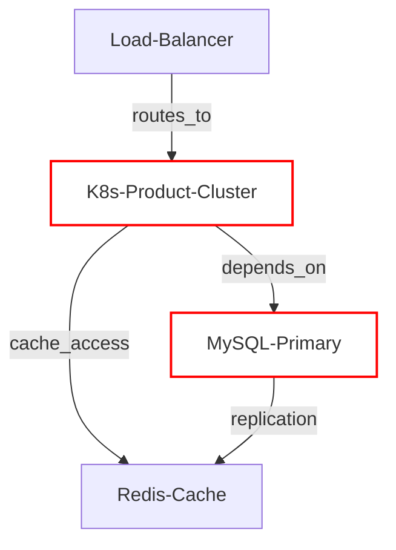

# IT诊断报告

## 问题概述
- **问题**: [基于根因告警的简要描述]
- **影响**: [基于告警影响范围的评估]
- **相关告警数**: [保留的告警总数]

## 告警列表
### 相关告警概述
**相关告警总数**: [总数] | **重要告警**: [严重等级计数] | **次要告警**: [警告等级计数]

| 集群名称                     | 网元名称 | 告警ID      | 发生时间 | 严重性 | 告警名称 | 原因  | IP  | 附加信息 |
|--------------------------|------|-----------|------|-----|------|-----|-----|------|
| ...                      | ...  | ALM-12345 | ...  | ... | ...  | ... | ... | ...  |
| [最多四行，包含所有根因告警和最多三个相关告警] |      |           |      |     |      |     |     |      |

## 关键发现
- **核心问题**: [从告警关联中识别的核心问题]
- **影响链**: [基于保留告警的因果传播链]
- **受影响组件**: [仅列出保留告警中的组件，编号列表]
- **根因分析**: [直接引用根因告警进行分析]

## 技术分析
### 1. 告警关联分析
[仅分析保留的告警，引用告警ID，例如 ALM-12345]

### 2. 系统影响评估
[仅基于保留告警中的组件评估影响]

### 3. 根因识别
[描述rootalarm]

**置信度**: [高 / 中 / 低]

## 系统拓扑与告警状态

> **图例说明**:
> - **红色边框**: 包含告警的节点使用红色边框，其余节点使用黑色默认边框。
> - **节点名称**: 显示原始 `clusterName`。

## 关键路径分析
- **主要故障路径**: [从根因告警组件到业务影响点的主要路径]
- **告警传播路径**: [基于完整拓扑的告警传播可能性分析]
- **瓶颈组件**: [基于拓扑结构识别关键组件]
- **影响范围**: [基于完整拓扑评估业务功能影响]

## 建议措施
### 立即行动
1.  [针对根因的具体恢复动作]
    *   [步骤1]
    *   [步骤2]
    *   [验证方法]
2.  [缓解业务影响]
    *   [回退或应急方案]
    *   [关键监控指标]